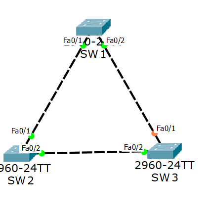
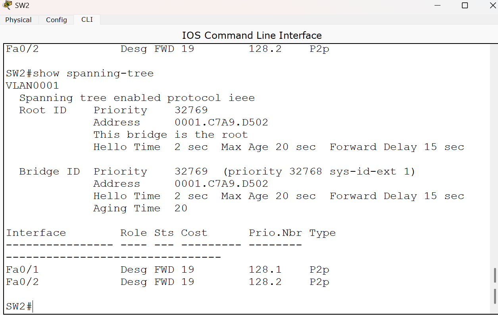
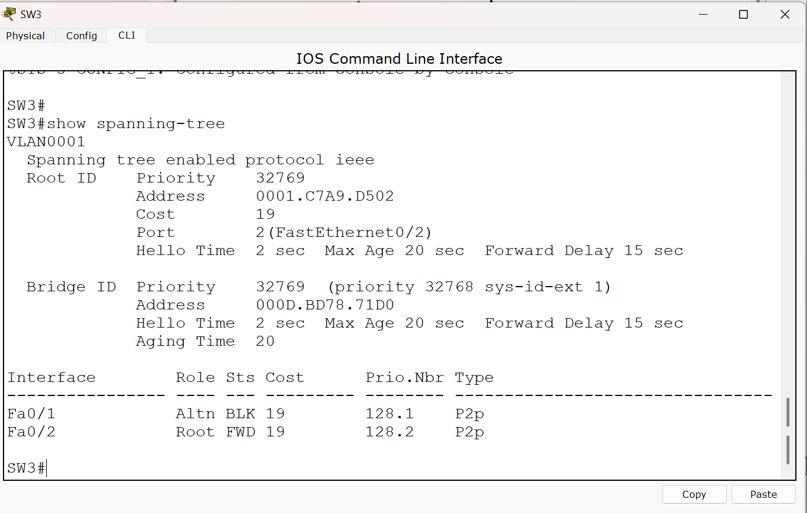
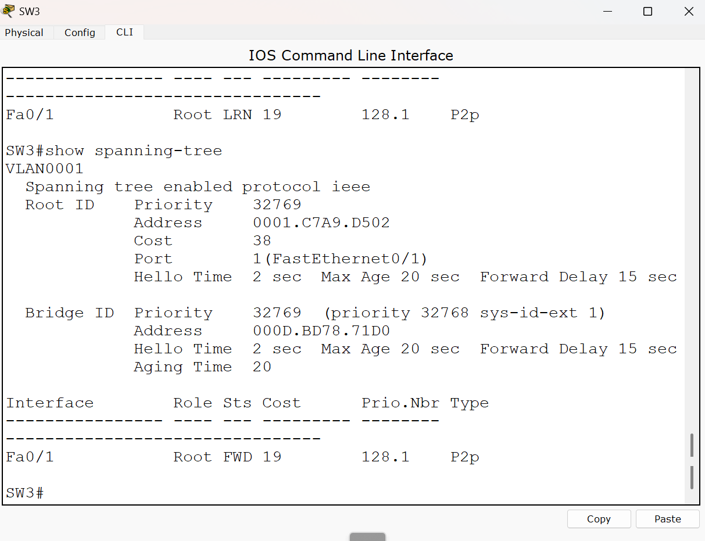

# CCNA Lab 12 – Spanning Tree Protocol (STP)

## Overview

This lab demonstrates how Spanning Tree Protocol (STP) prevents Layer 2 switching loops in a redundant network topology.

Three Cisco switches were connected in a triangular topology to provide redundant paths. STP automatically selected a Root Bridge and placed one redundant port into a blocking state.

A link failure was then simulated to observe STP reconvergence and automatic failover to the backup path.

## Objectives

- Understand the purpose of Spanning Tree Protocol (STP)
- Build a redundant Layer 2 topology
- Identify the Root Bridge
- Identify Root, Designated, and Alternate ports
- Observe how STP blocks a redundant path to prevent switching loops
- Simulate a link failure
- Observe STP reconvergence and automatic failover
- Verify STP operation using Cisco IOS commands

## Network Topology

Three Cisco 2960 switches were connected in a triangular topology.

```text
             SW1
            /   \
           /     \
         SW2-----SW3
       Root Bridge
```

This topology provides redundancy but also creates a potential Layer 2 loop.

STP prevents the loop by logically blocking one of the redundant paths.



## Initial STP Operation

STP was enabled automatically on the Cisco switches.

The following command was used to inspect the STP topology:

```cisco
show spanning-tree
```

## Root Bridge Election

SW2 was automatically elected as the Root Bridge.

The STP output on SW2 showed:

```text
Root ID    Priority    32769
           Address     0001.C7A9.D502

           This bridge is the root
```

Because SW2 is the Root Bridge, its active STP ports operate as Designated Forwarding ports.

```text
Fa0/1    Desg FWD
Fa0/2    Desg FWD
```



## STP Port Roles

### SW1

The STP output on SW1 showed:

```text
Fa0/1    Root FWD
Fa0/2    Desg FWD
```

`Fa0/1` was selected as the Root Port because it provides the best path from SW1 toward the Root Bridge.

`Fa0/2` operated as a Designated Forwarding port.

### SW2

SW2 was the Root Bridge.

```text
Fa0/1    Desg FWD
Fa0/2    Desg FWD
```

The Root Bridge does not require a Root Port because it is already the root of the spanning-tree topology.

### SW3

Initially, SW3 showed:

```text
Fa0/1    Altn BLK
Fa0/2    Root FWD
```

`Fa0/2` was the Root Port and provided the best path directly toward SW2.

`Fa0/1` was placed into the Alternate Blocking state to prevent a Layer 2 switching loop.



## Why STP Blocked a Port

Without STP, the triangular topology could allow broadcast frames to circulate continuously between the switches.

This could result in:

- Broadcast storms
- Duplicate frames
- MAC address table instability
- Network performance degradation

STP logically blocks one redundant path while keeping it available as a backup.

## Failover Test

To test STP redundancy, the direct link between SW2 and SW3 was manually disabled.

On SW2:

```cisco
enable
configure terminal
interface fa0/2
shutdown
end
```

Before the failure, SW3 used:

```text
Fa0/2    Root FWD
Fa0/1    Altn BLK
```

After the direct link failed, STP recalculated the topology.

The previously blocked `Fa0/1` interface transitioned through the STP states and eventually became:

```text
Fa0/1    Root FWD
```

The new Root Path Cost on SW3 became:

```text
Cost 38
```

This is because the new path to the Root Bridge was:

```text
SW3 → SW1 → SW2
```

Each FastEthernet link had an STP cost of 19:

```text
19 + 19 = 38
```

This demonstrated that STP automatically activated the redundant path after the primary path became unavailable.



## Restoring the Primary Link

The original link was restored using:

```cisco
configure terminal
interface fa0/2
no shutdown
end
```

After STP reconverged, SW3 returned to its original topology:

```text
Fa0/1    Altn BLK
Fa0/2    Root FWD
```

The redundant path was blocked again to prevent a switching loop.

## Verification Command

The main command used throughout the lab was:

```cisco
show spanning-tree
```

This command was used to verify:

- Root Bridge information
- Bridge ID
- Root Path Cost
- Root Port
- Designated Ports
- Alternate/Blocked Ports
- Port states

## What I Learned

- STP prevents Layer 2 switching loops in networks with redundant links.
- STP elects one switch as the Root Bridge.
- The Root Bridge is the reference point for STP path calculations.
- Non-root switches select a Root Port that provides the best path toward the Root Bridge.
- Designated Ports forward traffic on their network segments.
- Redundant ports can be placed into an Alternate Blocking state to prevent loops.
- STP keeps blocked links available as backup paths.
- If the primary path fails, STP recalculates the topology and can activate a previously blocked path.
- STP path cost is used when selecting the best path toward the Root Bridge.
- Redundancy can improve network availability without creating Layer 2 loops when STP is used.

## Author

**Kawthar Bader**  
Computer Networks Student | CCNA Learner | Building Networking Labs
